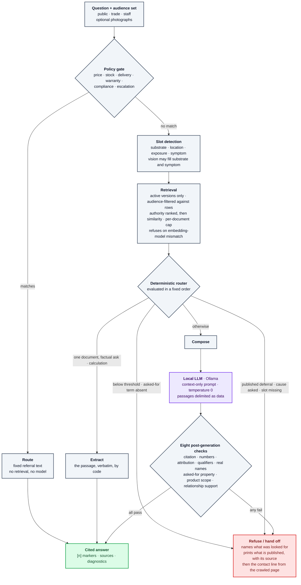
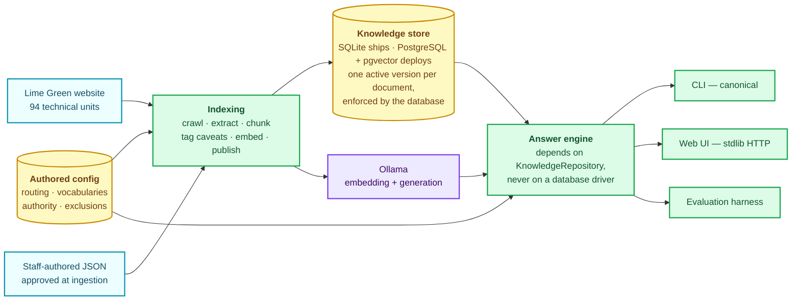

# Technical Knowledge Assistant

A retrieval-augmented assistant for Lime Green's published technical material. It answers product questions from indexed, versioned sources — every factual sentence cited, every figure traceable to the passage it came from — and refuses, with a hand-off, when the published material does not answer the question.

The organising idea is a separation of powers. **The model provides language. Retrieval provides evidence. Deterministic code provides control.** Routing, permissions, version filtering, policy gates, arithmetic, citation validation and the post-generation checks are all ordinary code that a technical team can read and argue with. The model runs on exactly one path, and nothing it produces prints until it has survived eight mechanical checks.

Local mode changes the infrastructure, never the safety semantics.

---

## Contents

- [What it does differently](#what-it-does-differently)
- [How an answer is produced](#how-an-answer-is-produced)
- [System shape](#system-shape)
- [Quick start](#quick-start)
- [Verify your install](#verify-your-install)
- [Repository structure](#repository-structure)
- [Configuration](#configuration)
- [Documentation](#documentation)
- [Status and known limitations](#status-and-known-limitations)

---

## What it does differently

A useful technical recommendation needs more than semantic search. Six properties are enforced in code rather than requested in a prompt:

| Property | What it means | Where it is enforced |
|---|---|---|
| **Grounded** | Answers come from the indexed corpus, never from model knowledge | Retrieval + check 1 (every sentence cited) |
| **Product-scoped** | The answer is about the product that was asked about, not a neighbouring one | Checks 3 and 7 |
| **Numerically exact** | Figures appear verbatim in the cited passage; units normalise for comparison, never for display | Check 2 |
| **Qualifier-preserving** | A temperature limit or "not suitable for DIY" travels with its figure | Check 4, plus document-level caveats appended by code |
| **Relationship-safe** | "Apply A over B" cannot silently become "B over A", and a compatibility claim needs a passage that states it | Check 8 (direction, polarity, conditions) |
| **Audience-isolated** | Staff material is never retrieved for a public caller — filtered against rows, before ranking | `assistant/knowledge/` and both storage adapters |
| **Fail-closed** | Weak or insufficient evidence produces a refusal that still carries what *is* published | Router steps 1 and 4; any failed check |

The last one is the thesis: **a refusal is cheaper than a wrong answer.** A weaker model does not produce worse answers here — it produces more refusals. Capability shows up as coverage, not as risk.

---

## How an answer is produced

Grey is deterministic code. Purple is the single step where the model runs. Red is where the system stops and hands over to a person.



Three things worth saying out loud:

- **The route is chosen before the model sees anything.** A published deferral — the Solo datasheet's own "many MgO boards are not suitable; contact us" — beats a quantity the system could otherwise compute. The company's own referral wins.
- **The model never originates a fact.** It composes over supplied passages on one path. Extract, route, refusal and hand-off run with no model at all.
- **A failed check is not retried or repaired.** It becomes a refusal that still carries the published material and the contact details, because a refusal is a designed outcome rather than a fault.

The full flow, including the vision stages and the router's exact precedence, is in [`docs/architecture.md`](docs/architecture.md).

---

## System shape



The single most important boundary is `KnowledgeRepository`. The answer engine depends on that interface and never on `sqlite3` or `psycopg`, which is what makes the offline assessment path and the deployed path **one system** rather than two that resemble each other. Both adapters implement the same ten tables, the same column names and the same version semantics — one logical schema, two dialects.

Detailed C4 container and multimodal diagrams: [`docs/diagrams/`](docs/diagrams/).

---

## Quick start

### Requirements

| | |
|---|---|
| **Python** | 3.12 or later — 3.13 is what the dependency set is pinned against and what CI runs. *(3.11 will not work: the pinned `numpy==2.5.3` requires ≥3.12.)* |
| **[Ollama](https://ollama.com/download)** | Running locally. No API key, no hosted service. |
| **Disk** | ~4 GB of models, plus the repository and generated index |
| **RAM** | Measured on 24 GB, CPU-only, no GPU |

Expect CPU inference to be slow: a question the model has not seen costs tens of seconds to minutes. This is measured and discussed in [`DECISIONS.md`](DECISIONS.md) under *Still open*.

### Install

```bash
python -m venv .venv
.venv\Scripts\activate          # Windows;  source .venv/bin/activate on macOS/Linux
pip install -r requirements.txt
```

Six pinned runtime dependencies — `httpx`, `beautifulsoup4`, `lxml`, `pymupdf`, `numpy`, `langgraph`. No LangChain agents, no vector database, no UI framework. Each one is argued for in [`DECISIONS.md`](DECISIONS.md).

### Pull the models

```bash
ollama pull qwen3.5:4b
ollama pull qwen3-embedding:0.6b
```

### Build the index

```bash
python -m assistant.indexing.index
```

The generated index is not committed, but the content-addressed **embedding cache is** (`data/embeddings.db`), so a clean clone indexes in seconds rather than the fifteen minutes the embeddings would otherwise cost. Add `--rebuild` to reprocess everything while retaining version history.

### Run it

```bash
# Web page at http://127.0.0.1:8765
python -m assistant.interfaces.ui

# Or a single question at the command line
python -m assistant.interfaces.cli -q "How much water does Solo Onecoat need per bag?"

# With full diagnostics: route taken, chunk ids, scores, checks
python -m assistant.interfaces.cli -q "..." -v
```

The CLI is canonical — the transcript and the evaluation harness both run through it, so a failure in the web page can never cost the evidence.

### Optional: image reading

```bash
# PowerShell
$env:ASSISTANT_VISION_DEMO = "1"; python -m assistant.interfaces.ui
```

Off by default, and that is a supported state rather than a broken one: an uploaded photograph is acknowledged and handed to a person, which is the published behaviour. Perception costs one to three minutes per image on a CPU. See [`DECISIONS.md` §16](DECISIONS.md).

---

## Verify your install

```bash
python scripts/preflight.py                   # interpreter, dependencies, Ollama reachable
python -m assistant.infrastructure.health     # readiness: DB, schema, models, snapshot compatibility
python -m assistant.infrastructure.health --json
python -m pytest tests/                       # 2324 tests
python -m eval.run                            # evaluation harness (needs Ollama; slow)
python -m assistant.infrastructure.trace      # read back how a given answer was produced
```

Liveness and readiness are different questions, and `health` answers the harder one: database reachable, schema present, repository usable, model available, and the snapshot's embedding model compatible with the one configured. A process that is merely running is not a process that can answer.

> [!WARNING]
> **`scripts/start-demo.ps1` and `scripts/verify-docker-deployment.{ps1,sh}` do not currently run.** They call module paths from before a package restructure (`assistant.ui`, `assistant.index`, `assistant.health`, `assistant.vision`) which no longer exist, so `start-demo.ps1` aborts at step 2 of 5. Use the manual commands above instead — they are the paths that work. See [Status and known limitations](#status-and-known-limitations).

---

## Repository structure

```
assistant/              The application. One package, no circular boundaries.
  answering/            Router (deterministic, ordered), extract/compose, the eight
                        post-generation checks, structured understanding, vision
                        perception, and presentation polish. No database driver
                        is importable from here.
  indexing/             Crawl → extract → chunk → tag caveats → embed → publish.
                        Delta-aware: unchanged documents are not reprocessed,
                        changed ones supersede, withdrawn ones deactivate.
                        Also the embedding cache, the durable job queue and
                        approved staff-knowledge import.
  knowledge/            The KnowledgeRepository boundary, the domain model, and
                        audience resolution (a request may narrow what the
                        operator allowed; it can never widen it).
    store/              The two adapters: SQLite (ships, offline, stdlib) and
                        PostgreSQL + pgvector (deployment). Same tables, same
                        column names, same version semantics.
  retrieval/            Question → passages the caller is allowed to see, plus
                        candidate eligibility: retrieving a passage that mentions
                        a product is not permission to recommend it.
  turn/                 The turn as a LangGraph state machine — ordering only.
                        Conversation state as typed, provenance-bearing facts,
                        and what a session deliberately forgets.
  interfaces/           CLI (canonical) and a standard-library HTTP web page.
                        Both are thin wrappers over the same library.
  infrastructure/       Ollama client, structured events and correlation ids,
                        trace read-back, Prometheus metrics, optional OTLP
                        export, and the readiness check.
  logging/              Diagnosis hand-off capture, feeding the failure library.

config/                 Hand-written, not derived: the routing table, slot and
                        property vocabularies with synonyms, deferral phrases,
                        authority ranks, audience rules and exclusion rules.
db/                     schema.sqlite.sql and schema.postgres.sql — one logical
                        schema in two dialects, including the partial unique
                        index that enforces one active version per document.
data/
  cache/                Original HTML and PDFs exactly as fetched, versioned,
                        with SHA-256, ETag and Last-Modified. Ships, so the
                        system can be rebuilt offline without re-crawling.
  embeddings.db         Content-addressed embedding cache. Committed deliberately
                        (decision 17) — keyed by text hash + model tag, so it
                        either hits correctly or misses and recomputes.
  index/                Generated knowledge.db and ingestion report. Not committed.
  staff/                Approved staff-authored source documents.
  failure_library/      Captured diagnosis hand-offs. Not committed.

eval/                   Evaluation harness: transcript situations, probe suite,
                        gold set, conversation scenarios, image fixtures, and a
                        synthetic staff-tagged fixture that must stay invisible
                        to a public caller. Results under eval/results/.
tests/                  2324 tests. Includes one behavioural repository-contract
                        suite run against both storage adapters.
  e2e/                  Playwright browser tests, opt-in via ASSISTANT_E2E.
scripts/                preflight, demo launcher, Docker verification.
tools/                  Failure-library curation, image fixture generation,
                        vision demonstration.
deploy/                 Dockerfile and compose.yaml — the production-like stack
                        (app + PostgreSQL/pgvector + Ollama). This is the current
                        one; the root Dockerfile and docker-compose.yml are stale.
spikes/                 The two throwaway implementations — LangGraph versus a
                        hand-written runner — that decision 20 rests on.
docs/                   Architecture, diagrams, deployment, demo runbook,
                        knowledge pipeline, reliability history.
```

---

## Configuration

Every setting has a working default. **A local run needs no configuration at all.**

There is no dotenv loader in this repository: [`.env.example`](.env.example) documents the variables and is read by Docker Compose, but a value written there reaches a local `python -m ...` run only if you export it in your shell first.

The variables worth knowing:

| Variable | Default | Effect |
|---|---|---|
| `ASSISTANT_POSTGRES_DSN` | *(empty → SQLite)* | **The only storage switch.** Selects the PostgreSQL adapter at every entry point. |
| `OLLAMA_HOST` | `http://127.0.0.1:11434` | Model server. Inside Compose use `ollama:11434`, never localhost. |
| `GENERATION_MODEL` | `qwen3.5:4b` | Composition and structured model calls. |
| `EMBED_MODEL` / `EMBED_DIMENSIONS` | `qwen3-embedding:0.6b` / `1024` | Recorded in the index header. Change either and the index must be rebuilt — the engine refuses to query a mismatched index rather than return confident nonsense. |
| `ASSISTANT_VISION_DEMO` | *(off)* | Enables image reading. Slow on CPU. |
| `ASSISTANT_PHRASING` | *(off)* | Optional wording-polish pass over an already-verified answer. |
| `ASSISTANT_EMBEDDING_CACHE` | `data/embeddings.db` | Content-addressed embedding cache. |

Hosted LangSmith tracing is **not** a variable you can set. It is closed in code by assignment in `assistant/__init__.py`, before anything imports it, so a hostile value inherited from a parent environment cannot switch it back on. `tests/test_privacy_tracing.py` proves that, with a control test proving the same values *would* enable it without this application.

The full annotated list, including the production-only and vision-tuning variables, is in [`.env.example`](.env.example).

---

## Documentation

| Document | What it covers |
|---|---|
| [`docs/architecture.md`](docs/architecture.md) | System design, C4 container view, answer-engine detail, component reference, live corpus inventory |
| [`DECISIONS.md`](DECISIONS.md) | Every decision: what was chosen, what else was possible, why, the evidence, and where it breaks |
| [`docs/knowledge-pipeline.md`](docs/knowledge-pipeline.md) | Indexing, versioning, delta updates, atomic publication |
| [`docs/deployment.md`](docs/deployment.md) | The `deploy/` container stack, configuration and operations |
| [`docs/demo-runbook.md`](docs/demo-runbook.md) | Startup, readiness, traces, latency, recovery |
| [`docs/RELIABILITY_AND_DESIGN_EVOLUTION.md`](docs/RELIABILITY_AND_DESIGN_EVOLUTION.md) | How measured failures drove design fixes |
| [`SETUP.txt`](SETUP.txt) | Step-by-step Windows setup, including image support |
| [`CLAUDE.md`](CLAUDE.md) | Engineering standards this repository is held to |

---

## Status and known limitations

Stated precisely, because an architectural intention is not an implementation claim.

**Built and verified**

Answer engine with deterministic routing and eight post-generation checks · delta-aware indexing with auditable version history · both storage adapters against one behavioural contract suite (PostgreSQL exercised in CI against real pgvector) · audience filtering inside retrieval · CLI, web UI and evaluation harness · structured observability, traces and metrics · vision perception, gated off by default.

**Known limitations**

- **Local CPU latency.** A question the model has not seen costs tens of seconds; the repeat is nearly free from cache. Do not quote the transcript's median — it measures Ollama's prompt cache.
- **The audience set is asserted, not authenticated.** The filter is real and enforced in code; the identity behind the claim is not. Over HTTP a request can only narrow what the operator allowed.
- **Conversation state is not durable.** The LangGraph checkpointer is in-memory: `langgraph-checkpoint-postgres` 3.0.1 requires `langgraph-checkpoint<4` while `langgraph==1.2.11` requires `>=4.1.0`, so `checkpointer_for()` raises rather than pretending. Session state *is* persisted separately.
- **No queue and no rate limiting.** Generation is one at a time per Ollama instance, so concurrency helps cached and non-compose answers only.
- **PostgreSQL is contract-verified, not operated.** It passes the same suite against real pgvector; no Postgres instance has answered a question outside a test.
- **Compatibility is enforced by evidence, not by a matrix.** No product-to-substrate compatibility data exists in the corpus and none was invented — unknown reads as unknown, never as permission.

**Broken and not yet fixed** — found during a documentation audit; recorded here rather than papered over:

| Where | Problem |
|---|---|
| `scripts/start-demo.ps1` | Calls `assistant.ui`, `assistant.index`, `assistant.health`, `assistant.vision` — all removed by the package restructure. Aborts at step 2 of 5. |
| `scripts/verify-docker-deployment.{ps1,sh}` | Same class of stale module paths, so the scripts that verify the container stack cannot run. |
| `deploy/Dockerfile` | `CMD` is `python -m assistant.ui`; `deploy/compose.yaml` sets no override, so the production stack's app container exits immediately. It also copies the embedding cache to `data/index/embeddings.db`, one directory below where `embedcache.py` looks — harmless under Compose, which bind-mounts over it, but a plain `docker run` would silently re-embed every passage. |
| `.github/workflows/tests.yml` | The safety-critical coverage gate lists seven pre-restructure paths; all report "not measured". |
| `scripts/preflight.py` | Permits Python 3.11, but the pinned `numpy==2.5.3` requires ≥3.12. |
| Root `Dockerfile`, `docker-compose.yml` | Superseded by `deploy/`, which is what CI builds and what both verification scripts target. The root `CMD` is also a stale module path, and the root compose maps port 8000 while the server it starts listens on 8765. |

---

## Design philosophy

Prompt engineering is not the safety mechanism.

- **Evidence is retrieved**, not generated.
- **Policy is deterministic code**, not prompt instructions.
- **Routing is explicit and ordered**, with stated precedence.
- **Verification happens after generation**, not inside the prompt.
- **Failure reduces coverage, not safety.**

The model is not the source of truth and is not the controller. Language generation is allowed flexibility; product identity, evidence sufficiency, numeric support, citations and refusal boundaries remain governed by structured state and deterministic verification.
