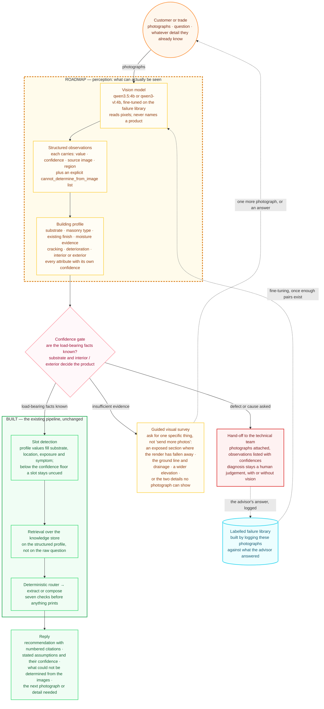

# Architecture — Technical Knowledge Assistant

**What the system is**: two diagrams, a component reference, and the site inventory they rest on. **Why it is this way** — every decision, its alternatives and its cost — is in [`DECISIONS.md`](../DECISIONS.md).

The shape in one sentence: a question is answered only from retrieved passages, every fact cited, with a refusal that still hands over whatever is published when the material runs out — and the knowledge pipeline validates changed sources and publishes controlled releases on either backend.

These repository diagrams are the reference. The presentation slide carries a collapsed spine of the second one — input, split and gate, retrieve, router, model, checks, reply — not the full flow.

## Knowledge release implementation

[The knowledge pipeline runbook](knowledge-pipeline.md) traces the supplied presentations to code, tests and operation. It covers source revalidation, immutable originals, staff approval, structure-aware chunking, validated vectors, atomic delta publication, request snapshots and both database adapters. [Decision 19](../DECISIONS.md#19-controlled-knowledge-releases-and-operational-evidence) explains the alternatives and tradeoffs.

## 1. Container view

Colour key (as on the diagram's title): **green = built for the submission**, **amber, rose and pink = production-only**, **cyan and sky = data, website and evaluation**, **violet = local models and the answer engine**, **grey = shipped cache**. The slide version collapses this to built / roadmap / external.

Three groups inside one system boundary: **Indexing path** (crawler, immutable cache, approved staff import and local durable job queue are implemented; the external scheduler supplies cadence), **Retrieval data** (the knowledge store and the hand-written configuration — the only place inside the system where the two paths meet; both paths also depend on the same embedding model, which is why the snapshot records its model tag and the engine refuses to run against a mismatch), **Question-answering path** (engine, CLI, web UI and evaluation harness built; channel adapters, identity and the serving layer are roadmap).

Source: [`diagrams/container-view.mmd`](diagrams/container-view.mmd)

```mermaid
C4Container
    title Container diagram — Technical Knowledge Assistant<br/>Colour key: green = built for the submission · amber, rose and pink = production-only · cyan and sky = data, website and evaluation · violet = local models and the answer engine · grey = shipped cache

    Person(user, "Customer, trade, or staff", "Asks product questions")
    System_Ext(website, "Lime Green website", "Product pages, datasheets, FAQs, articles, guides, contact, supplier, and sample pages")
    System_Ext(staff, "Staff-knowledge capture", "Production source for approved answers, the labelled failure library, and compatibility data")

    Boundary(ollama, "Ollama — local model server", "external") {
        System_Ext(emb, "Embedding model", "qwen3-embedding:0.6b or nomic-embed-text; verified at build")
        System_Ext(gen, "Generation model", "qwen3.5:4b — one family for text now and vision later; qwen3:4b-instruct is the fallback")
    }

    Container_Boundary(assistant, "Technical Knowledge Assistant") {
        Container_Boundary(indexing, "Indexing path") {
            Container(receiver, "Refresh trigger", "Scheduled CLI", "Revalidates with ETag and Last-Modified; compares content hashes")
            ContainerQueue(queue, "Indexing queue", "Local durable SQLite jobs", "Buffers jobs, retries with backoff, and dead-letters failures")
            Container(indexer, "Indexer", "Python", "Crawls, caches, extracts, chunks, tags caveats, embeds, and atomically publishes the index")
            ContainerDb(cache, "Source document store", "Versioned filesystem — ships with the submission", "Original HTML and PDFs as fetched, with SHA-256, ETag and Last-Modified per version. The filesystem holds the evidence; the knowledge store holds its identity and history")
        }

        Container_Boundary(data, "Retrieval data") {
            ContainerDb(store, "Knowledge store", "SQLite for assessment; PostgreSQL + pgvector in production — one schema, two dialects", "documents, document_versions, chunks, embeddings, caveats, excluded documents, crawl runs, index snapshots. Exactly one active version per document, enforced by the database")
            ContainerDb(config, "Authored configuration", "Hand-written files", "Routing, vocabulary with synonyms, deferrals, authority, audience, and exclusion rules")
            ContainerDb(answercache, "Answer cache", "Built — exact-key, in process", "Finished answers keyed on the normalised question, audience set, snapshot id, generation model, and chunking version; the template-keyed form is roadmap")
        }

        Container_Boundary(answering, "Question-answering path") {
            Container_Boundary(access, "Inputs and integrations") {
                Container(cli, "CLI", "Python", "Question and audience set in; answer, sources, refusal, and diagnostics out; canonical for the transcript and the harness")
                Container(ui, "Web UI", "Python stdlib HTTP server", "A thin page over the same library, for the demonstration")
                Container(channels, "Channel adapters", "Production only", "Website widget, CRM, and training platform")
                Container(identity, "Identity and audience", "Production only", "Resolves the caller to an audience set: public, trade, or staff; anonymous callers get public only")
                Container(serving, "Serving layer", "Production only", "Generation queue with a visible wait, per-session rate limiting, and extract-only degradation under load")
                Container(vision, "Vision perception", "Production only — VLM", "Reads uploaded photographs into structured observations: value, confidence, source image, region, and what cannot be determined. Never names a product")
            }

            Container_Boundary(core, "Answering and evaluation") {
                Container(engine, "Answer engine", "Python library", "Deterministic router followed by retrieval-augmented generation. Depends on the KnowledgeRepository interface, never on a database driver, so the assessment and deployment paths are one system")
                Container(eval, "Evaluation harness", "Python, offline", "Transcript situations, probe suite, threshold sweep, pass/fail, and a staff-tagged fixture")
            }
        }
    }

    Rel_D(website, indexer, "Sitemap discovery and conditional refresh")
    Rel_D(website, receiver, "Sitemap last-modified")
    Rel_D(staff, queue, "New or changed documents")
    Rel_R(receiver, queue, "Enqueues changed URLs")
    Rel_R(queue, indexer, "Delivers jobs")
    BiRel(indexer, cache, "Writes versions on crawl; reads them on index")
    Rel_D(indexer, config, "Reads rules and exclusions")
    Rel_U(indexer, emb, "Embeds chunks")
    Rel_R(indexer, store, "Publishes a snapshot atomically; the superseded version is deactivated in the same transaction")
    Rel_D(user, cli, "Asks a question")
    Rel_D(user, ui, "Asks a question")
    Rel_R(cli, engine, "Question and audience set")
    Rel_R(ui, engine, "Question and audience set")
    Rel_D(ui, vision, "Uploaded photographs")
    Rel_R(vision, engine, "Observations fill slots; below the confidence floor the slot stays uncued")
    Rel_D(staff, vision, "Labelled failure library, for fine-tuning")
    Rel_R(channels, identity, "Request with session")
    Rel_R(identity, serving, "Audience set: public, trade, or staff")
    Rel_L(serving, engine, "Queued, rate limited; extract-only under load")
    Rel_U(engine, answercache, "Reads and writes composite parts")
    Rel_D(eval, engine, "Drives situations and probes")
    Rel_U(engine, store, "Retrieves via KnowledgeRepository: active versions only, audience-filtered in code before ranking, authority then similarity")
    Rel_U(engine, config, "Reads routing and policy")
    Rel_U(engine, emb, "Embeds question")
    Rel_U(engine, gen, "Composes answer from retrieved passages")

    UpdateElementStyle(user, $bgColor="#fff7ed", $borderColor="#fb923c", $fontColor="#7c2d12")
    UpdateElementStyle(website, $bgColor="#ecfeff", $borderColor="#22d3ee", $fontColor="#155e75")
    UpdateElementStyle(staff, $bgColor="#fdf4ff", $borderColor="#e879f9", $fontColor="#86198f")
    UpdateElementStyle(emb, $bgColor="#f5f3ff", $borderColor="#a78bfa", $fontColor="#4c1d95")
    UpdateElementStyle(gen, $bgColor="#f5f3ff", $borderColor="#a78bfa", $fontColor="#4c1d95")

    UpdateElementStyle(indexer, $bgColor="#f0fdf4", $borderColor="#4ade80", $fontColor="#166534")
    UpdateElementStyle(cache, $bgColor="#f8fafc", $borderColor="#94a3b8", $fontColor="#334155")
    UpdateElementStyle(store, $bgColor="#ecfeff", $borderColor="#22d3ee", $fontColor="#155e75")
    UpdateElementStyle(config, $bgColor="#f0f9ff", $borderColor="#38bdf8", $fontColor="#0c4a6e")
    UpdateElementStyle(cli, $bgColor="#f0fdf4", $borderColor="#4ade80", $fontColor="#166534")
    UpdateElementStyle(ui, $bgColor="#f0fdf4", $borderColor="#4ade80", $fontColor="#166534")
    UpdateElementStyle(engine, $bgColor="#eef2ff", $borderColor="#818cf8", $fontColor="#3730a3")
    UpdateElementStyle(eval, $bgColor="#f0f9ff", $borderColor="#38bdf8", $fontColor="#0c4a6e")

    UpdateElementStyle(receiver, $bgColor="#fffdf5", $borderColor="#fcd34d", $fontColor="#92400e")
    UpdateElementStyle(queue, $bgColor="#f0fdf4", $borderColor="#4ade80", $fontColor="#166534")
    UpdateElementStyle(channels, $bgColor="#fffafd", $borderColor="#f0abfc", $fontColor="#86198f")
    UpdateElementStyle(identity, $bgColor="#fffdf5", $borderColor="#fcd34d", $fontColor="#92400e")
    UpdateElementStyle(serving, $bgColor="#fff8fa", $borderColor="#fda4af", $fontColor="#9f1239")
    UpdateElementStyle(vision, $bgColor="#fffdf5", $borderColor="#fcd34d", $fontColor="#92400e")
    UpdateElementStyle(answercache, $bgColor="#f0fdf4", $borderColor="#4ade80", $fontColor="#166534")

    UpdateRelStyle(website, indexer, $textColor="#155e75", $lineColor="#22d3ee", $offsetX="-34", $offsetY="-18")
    UpdateRelStyle(website, receiver, $textColor="#155e75", $lineColor="#22d3ee", $offsetX="38", $offsetY="18")
    UpdateRelStyle(staff, queue, $textColor="#86198f", $lineColor="#e879f9", $offsetX="-36", $offsetY="18")
    UpdateRelStyle(receiver, queue, $textColor="#92400e", $lineColor="#fcd34d", $offsetY="-20")
    UpdateRelStyle(queue, indexer, $textColor="#9f1239", $lineColor="#fda4af", $offsetY="20")
    UpdateRelStyle(indexer, cache, $textColor="#166534", $lineColor="#4ade80", $offsetY="-20")
    UpdateRelStyle(indexer, config, $textColor="#0c4a6e", $lineColor="#38bdf8", $offsetX="34")
    UpdateRelStyle(indexer, emb, $textColor="#4c1d95", $lineColor="#a78bfa", $offsetX="32", $offsetY="-20")
    UpdateRelStyle(indexer, store, $textColor="#155e75", $lineColor="#22d3ee", $offsetX="34", $offsetY="18")
    UpdateRelStyle(user, cli, $textColor="#7c2d12", $lineColor="#fb923c", $offsetX="30")
    UpdateRelStyle(cli, engine, $textColor="#166534", $lineColor="#4ade80", $offsetY="-20")
    UpdateRelStyle(user, ui, $textColor="#7c2d12", $lineColor="#fb923c", $offsetX="-30")
    UpdateRelStyle(ui, engine, $textColor="#166534", $lineColor="#4ade80", $offsetY="20")
    UpdateRelStyle(channels, identity, $textColor="#86198f", $lineColor="#f0abfc", $offsetY="-20")
    UpdateRelStyle(identity, serving, $textColor="#92400e", $lineColor="#fcd34d", $offsetY="-20")
    UpdateRelStyle(serving, engine, $textColor="#9f1239", $lineColor="#fda4af", $offsetY="20")
    UpdateRelStyle(ui, vision, $textColor="#92400e", $lineColor="#fcd34d", $offsetY="20")
    UpdateRelStyle(vision, engine, $textColor="#92400e", $lineColor="#fcd34d", $offsetX="-36", $offsetY="-20")
    UpdateRelStyle(staff, vision, $textColor="#86198f", $lineColor="#e879f9", $offsetX="40")
    UpdateRelStyle(engine, answercache, $textColor="#92400e", $lineColor="#fcd34d", $offsetX="-38", $offsetY="20")
    UpdateRelStyle(eval, engine, $textColor="#0c4a6e", $lineColor="#38bdf8", $offsetY="20")
    UpdateRelStyle(engine, store, $textColor="#155e75", $lineColor="#22d3ee", $offsetX="42", $offsetY="-22")
    UpdateRelStyle(engine, config, $textColor="#0c4a6e", $lineColor="#38bdf8", $offsetX="-42", $offsetY="-22")
    UpdateRelStyle(engine, emb, $textColor="#4c1d95", $lineColor="#a78bfa", $offsetX="40", $offsetY="22")
    UpdateRelStyle(engine, gen, $textColor="#4c1d95", $lineColor="#a78bfa", $offsetX="-40", $offsetY="22")

    UpdateLayoutConfig($c4ShapeInRow="2", $c4BoundaryInRow="2")
```

**Who sees what.** Every chunk carries audience tags and retrieval filters to the caller's audience set — in code, never by prompt. Three audiences, not two: **staff** (authenticated, full corpus plus internal material), **trade** (stockists and contractors, who in production may have portal access to trade lead times, stock and kit lists), and **public** (anonymous, published material only). In the prototype the audience set is a flag the caller asserts; in production it comes from the identity step.

The two adapters enforce that filter in different places, and the difference is worth stating rather than smoothing over, because it is the claim a panel is most likely to probe. The PostgreSQL adapter filters in the query: `c.audience = ANY(...)` sits beside the distance operator in the same statement, so a forbidden row is never selected. The SQLite adapter — the one that ships, and the one that serves every answer in the transcript — selects the active chunks, then filters them by audience in Python inside the adapter, before scoring and before returning anything. Both filter in code, both filter before ranking, and neither is reachable by a prompt instruction; a staff-tagged fixture is provably invisible to a public caller in the evaluation and in the tests. What differs is only the mechanism, so "the filter is a `WHERE` clause" is accurate of the deployment path and not of the assessment path. The residual exposure is not the filter but the assertion behind it: the audience set is claimed, not authenticated, and over HTTP a request may only narrow what the operator started the server with.

**Concurrency.** Each answer pins a consistent read transaction; writers publish atomically. SQLite serializes writes and PostgreSQL supports concurrent readers. Capacity still requires load measurement. Generation is the only bottleneck, one at a time per Ollama instance. Production therefore adds a serving layer (generation queue with a visible wait, per-session rate limiting) that degrades by dropping the compose path, not by dropping a check, and an answer cache in front of it.

## 2. Answer engine detail

What the `Answer engine` container does with one question. Its own colour key: **grey = deterministic code**, **purple = the one step where the model runs**, **red = where the system stops and hands over**.

Source: [`diagrams/answer-engine-detail.mmd`](diagrams/answer-engine-detail.mmd)

```mermaid
flowchart TD
    classDef code fill:#f8fafc,stroke:#64748b,color:#1e293b,stroke-width:2px
    classDef model fill:#f5f3ff,stroke:#7c3aed,color:#4c1d95,stroke-width:2px
    classDef stop fill:#fef2f2,stroke:#dc2626,color:#7f1d1d,stroke-width:2px

    IN["Question + audience set (public / trade / staff)<br/>from the identity step in production; an asserted flag at the CLI in the prototype<br/>input capped at about 500 words"]
    SPLIT["Split by topic<br/>policy patterns + slot vocabularies; each part is gated and routed on its own;<br/>a published lead time or cut-off becomes its own part and takes the retrieval path;<br/>the symptom part of a complaint takes the diagnosis path"]
    POLICY{"Policy gate — pattern?<br/>price · stock · delivery · where to buy · colour matching · warranty ·<br/>structural judgement · compliance sign-off · health · complaint escalation · document request"}
    ROUTE["Route<br/>fixed referral text per topic from the routing table; no retrieval;<br/>document requests answered from the manifest, filtered by audience tags: name, date, link"]
    SLOTS["Slot detection (vocabularies, with synonyms)<br/>substrate · location · exposure · calculation words · symptom · cause asked · photograph · property asked for;<br/>the photograph slot adds the cannot-see-photographs line to whatever path is taken; it does not by itself route to diagnosis;<br/>load-bearing slots (substrate, inside / outside): cued → value used, uncued → decided at router step 5;<br/>other missing slots become stated assumptions<br/>[production] a vision model fills substrate, coatings, symptom and exposure from photographs,<br/>each with a confidence; below the floor the slot stays uncued and the flow is unchanged"]
    RETRIEVE["Retrieval [via KnowledgeRepository]<br/>embed the question (Ollama); similarity over the knowledge store; top-k with a per-document cap;<br/>active versions only; filtered to the caller's audience set in code before ranking, never by prompt<br/>(a WHERE clause in the PostgreSQL adapter; a row filter inside the SQLite adapter, which is the one that ships);<br/>ranked by authority (datasheet > product page > knowledge-base article > FAQ), newest wins within a type;<br/>refuses to run if the snapshot's embedding model or chunking version does not match"]
    ROUTER{"Deterministic router — evaluated in order<br/>1 below threshold → refuse · 2 top passage defers → cited hand-off (a published deferral beats a computed quantity)<br/>3 a cause or defect is asked → diagnosis (a photograph alone is not a diagnosis request) · 4 asked-for term absent from every passage, synonyms applied → refuse: 'not stated'<br/>5 load-bearing slot uncued → per option (inside / outside) or ask back (substrate) · 6 calculation words → extract, sum refused<br/>7 one document and a factual ask → extract · 8 otherwise → compose · staff audience: extract (compose on request is roadmap)"}
    DIAG["Diagnosis — composite: published causes + hand-off<br/>published causes quoted with source; 'cannot see photographs'"]
    EXTR["Extract — by code, no model<br/>the top passage (coverage and pack-size passages on the calculation edge), whole, with its citation;<br/>a passage is a section or a bullet, so its caveats stay attached;<br/>document caveats appended by code, at most three"]
    COMPOSE["Compose — the model composes with [n] markers<br/>per option when inside / outside is uncued;<br/>regulatory asks: explained from the knowledge base, never certified; building control named;<br/>document caveats appended by code, at most three"]
    DEFER["Cited hand-off<br/>the deferral sentence quoted and cited"]
    REFUSE["Refuse"]
    MODEL["Local LLM [Ollama]<br/>context-only prompt, passages delimited as data · temperature 0 · fixed seed · fixed model tag<br/>five passages, at most three per document · answer capped at about 200 tokens<br/>[prompt]: never blend two versions; never interchangeable without a passage; never judge or promise an outcome; no evaluation of other brands"]
    CHECKS["Post-generation checks, in order<br/>1 every sentence cited, with word overlap to its passage<br/>2 numbers verbatim in the cited passage (units normalised for comparison only)<br/>3 numbers stay with their product<br/>4 qualifiers and caveats travel with their figure inside the printed passage; document-level caveats are appended separately<br/>5 real names only: products, colours, documents, merchants — name lists built at ingestion<br/>6 the asked-for property or substrate term, or a synonym, appears in a cited passage<br/>7 the answer is about the product that was asked about, not a different product"]
    HANDOFF["Hand-off renderer — for refusal, diagnosis, cited hand-off and ask-back<br/>on refusal, names what was looked for: 'not stated in the indexed material'; on ask-back, names the detail needed;<br/>what is published first, with its source; if the photograph slot is set: 'cannot see photographs' and the two details to send;<br/>then the contact line and hours from the manifest<br/>(a richer staff-only refusal view — nearest candidates with scores and passage text — is roadmap, not built)"]
    OUT["Composite reply<br/>parts labelled: answered · from the datasheet · not published · where to go<br/>Answer with [n] markers · Sources: document name (URL)<br/>per-query diagnostics: path taken, chunk ids, sources, scores, layer that fired"]

    IN --> SPLIT --> POLICY
    POLICY -->|"matches"| ROUTE
    POLICY -->|"no match"| SLOTS --> RETRIEVE --> ROUTER
    ROUTER -->|"1 below threshold · 4 asked-for term absent"| REFUSE
    ROUTER -->|"2 top passage defers"| DEFER
    ROUTER -->|"3 a cause or defect is asked"| DIAG
    ROUTER -->|"5 substrate uncued: ask back"| HANDOFF
    ROUTER -->|"6 calculation words: coverage and pack-size passages, sum refused"| EXTR
    ROUTER -->|"7 one document and a factual ask"| EXTR
    ROUTER -->|"5 inside / outside uncued: per option · 8 otherwise"| COMPOSE
    COMPOSE --> MODEL --> CHECKS
    SLOTS -.->|"stated assumptions"| MODEL
    CHECKS -->|"all pass"| OUT
    CHECKS -->|"any check fails"| REFUSE
    REFUSE --> HANDOFF
    DIAG --> HANDOFF
    DEFER --> HANDOFF
    IN -.->|"audience set"| RETRIEVE
    IN -.->|"audience set"| ROUTER
    IN -.->|"audience set"| ROUTE
    IN -.->|"audience set"| HANDOFF
    ROUTE --> OUT
    EXTR --> OUT
    HANDOFF --> OUT

    class IN,SPLIT,POLICY,ROUTE,SLOTS,RETRIEVE,ROUTER,DIAG,EXTR,COMPOSE,DEFER,CHECKS,OUT code
    class MODEL model
    class REFUSE,HANDOFF stop
```

Four things to say out loud from this diagram:

- **The route is decided by code, before the model sees anything, in a stated order.** Below threshold, then a published deferral (which beats a computed quantity — "how much Solo for MgO board" gets the sheet's "contact us", not a bag count), then symptoms, then the relevance gate, then uncued load-bearing slots, then calculation words, then one document with a factual ask, otherwise compose. Slots are detected before retrieval, but the retrieval-shape steps are evaluated first because a below-threshold or deferring result must not be overridden by a slot-driven branch — and a photograph question that retrieves nothing still gets "cannot see photographs", because the hand-off renderer keys that line on the slot, not the path. Instructions inside a question or a passage change nothing.
- **The model runs on one path only — Compose — and never originates a fact.** Five paths as the record defines them (route, extract, compose, cited hand-off, refuse); diagnosis is a composite of quoted causes plus hand-off, and calculation is extract over the coverage and pack-size passages with the sum refused. Temperature zero and a fixed seed keep the run repeatable.
- **The near-miss is caught by the relevance gate, on both printing paths.** The property or substrate asked for, or a synonym, must appear in the passage (router step 4 on Extract; check 6 on Compose). Product-scope correctness is verified by check 7. A confident retrieval and citation are not enough.
- **Any failed check goes to Refuse, and a refusal still carries value** — it names what was looked for, prints what is published with its source, appends the document's own caveats, then the contact line from the crawled contact page, never a named individual.

## 3. Multimodal roadmap — not built

Photographs arrive in eight of the fifteen external situation archetypes, and the partnership names multimodal guardrails as an activity. The prototype detects a photograph, says it cannot see it, and hands over (DECISIONS 16). This is what reading them would look like, and the whole of it is roadmap.

Three properties make it consistent with what is already built rather than a parallel system:

- **The vision model never names a product.** Perception, interpretation and recommendation stay separate stages. Collapsing them — "I see rising damp, therefore use Product X" — fuses an uncertain visual inference to a commercial recommendation.
- **Every observation is auditable.** Value, confidence, source image and the region within it. A bounding box is to a visual claim what a cited passage is to a textual one, which is the same discipline the seven post-generation checks enforce today.
- **It feeds the existing router.** Profile values fill slots; below the confidence floor a slot stays uncued and the load-bearing-slot rule already handles it. No new answer path, no new guardrail surface.

Source: [`diagrams/multimodal-roadmap.mmd`](diagrams/multimodal-roadmap.mmd)

Two things on this diagram matter more than the models. **Diagnosis still hands off to a human**, with or without vision — the reason is liability, not capability, so seeing the photograph does not license acting on it. And the **hand-off is the data-collection mechanism**: logging these photographs against what the advisor answered is what builds the labelled failure library, which is what eventually makes fine-tuning possible. The model is the easy part; the dataset is the partnership.

## 4. Component reference

Built = in the submission. Roadmap = drawn and argued, not built. The reason each exists is in [`DECISIONS.md`](../DECISIONS.md).

| Component | Status | What it does |
|---|---|---|
| **Lime Green website** | External | Published website corpus: 94 technical units, inventoried below; approved staff imports are an additional source |
| **Embedding model** (Ollama) | External | Turns chunks and questions into vectors; qwen3-embedding:0.6b or nomic-embed-text, verified at build |
| **Generation model** (Ollama) | External | Composes over retrieved passages on the Compose path only; qwen3.5:4b, with qwen3:4b-instruct as the fallback |
| **Staff-knowledge capture** | Partial | Approved JSON ingestion is implemented. Expert authoring, authenticated approvals, failure library and compatibility matrix remain partnership work |
| **Indexer** | Built, delta-aware | Diffs the crawl against the content hashes of what is **currently served**, then processes only new and changed documents: extract (PyMuPDF for PDFs) → classify by link text → strip boilerplate and hazard blocks → chunk by heading, bullets and labelled sub-paragraphs kept whole → tag caveat sentences → embed → apply the delta in one transaction. A changed document supersedes the version it replaces and that version is retained; a withdrawn one is deactivated, never deleted; an unchanged one is hashed but not re-extracted, re-chunked or re-embedded. Name harvesting is deliberately a full pass every run, because it costs a second and stale lists would leave a withdrawn colour in the vocabulary check 5 trusts. Model/dimension/chunking changes automatically reprocess the corpus; `--rebuild` forces reprocessing while retaining history |
| **Source document store** | Built, shipped | Original HTML and PDFs as fetched, on a versioned filesystem, with SHA-256, ETag and Last-Modified per version. The filesystem holds the evidence; the knowledge store holds its identity and history. Ships so the assessors run offline without repeating the crawl |
| **Refresh trigger** | Built | Scheduled CLI jobs invoke conditional crawl and indexing. A configured cron or Task Scheduler job supplies cadence |
| **Indexing queue** | Built | Durable local SQLite jobs, idempotent enqueue, backoff, expiring leases and dead-letter evidence; one ingestion host |
| **Knowledge store** | Built | `documents`, `document_versions`, `chunks`, `document_caveats`, `excluded_documents`, `crawl_runs`, `index_snapshots`. Exactly one active version per document, enforced by a partial unique index rather than by application code. Two adapters behind `KnowledgeRepository`: SQLite for the assessment path (stdlib, ships, offline), PostgreSQL + pgvector for deployment — same tables, same column names, same version semantics, and both implement the same delta contract: `apply_delta`, `active_content_hashes`, `versions` and `crawl_runs` |
| **Authored configuration** | Built | Routing table; slot, calculation, symptom and property vocabularies with synonyms; deferral phrases; authority and audience rules per source; exclusion rules |
| **Answer cache** | Built, exact-key | Finished answers keyed on the normalised question, the audience set, the snapshot id, the generation model and the chunking version. Refusals cached too. The template-keyed form decision 14 designs is roadmap; this is the weaker exact-match form, identical on safety and poorer on hit rate |
| **Answer engine** | Built | Split by topic → policy gate per part → slot detection → audience-filtered retrieval → deterministic router → model on Compose only → seven checks → document caveats appended by code → hand-off with value. Depends on `KnowledgeRepository`, never on a database driver |
| **CLI** | Built | Question and audience set in; answer, sources, refusal and diagnostics out. Canonical: the transcript and the harness run through it |
| **Web UI** | Built | A thin standard-library HTTP page over the same library, for the demonstration |
| **Evaluation harness** | Built | Nine transcript situations — including the two multi-source ones decision 7.3 scores grounded reasoning on — plus the probe suite, threshold sweep, pass/fail, self-describing header, and one synthetic staff-tagged fixture that must be invisible in public mode |
| **Identity and audience** | Roadmap | Resolves the caller to an audience set — public, trade or staff; anonymous gets public only |
| **Serving layer** | Roadmap | Generation queue with a visible wait, per-session rate limiting, extract-only degradation under load |
| **Channel adapters** | Roadmap | Website widget, CRM, training platform — calling the engine as a library |
| **Vision perception** | Roadmap | Reads uploaded photographs into structured observations — value, confidence, source image, region, and an explicit list of what cannot be determined. Fills slots on the existing router; never names a product. See DECISIONS 16.1 |

## Appendix: live site inventory (the record's decision 0, confirmed 15 September 2026)

Method: `sitemap.xml` (exists, complete, referenced from `robots.txt`); every product, knowledge-base, support and Warmshell page fetched once; three datasheet PDFs extracted with PyMuPDF. Corrects the mental-model record's §8.6 hypothesis.

**Products — 36 pages in 6 categories; 33 have a technical datasheet; 34 datasheet PDFs** (Natural Lime Mortar links two, Medium and Strong).
- No datasheet: Solo Filler (SDS only), Warmshell 660 Mesh (no documents at all), Silic8 AeroGel Adhesive (installation guide and SDS). The "named product with no indexed datasheet" guardrail case is real.
- Pages are thin: substrates, uses, compatible products, colours; every number is deferred to the datasheet. Worth indexing for selection questions; the repeated 24-colour list is boilerplate to strip.
- Datasheet link text varies ("Datasheet", "Data Sheet", "TDS", "DATA SHEET", "Data sheet Medium", "Data Sheets"); filenames are inconsistent, with spaces and typos ("Insualtion", "silgaurd", "Peformance") — classify by link text, resolve hrefs exactly as given.
- Other document types per product: SDS, UK/EU DoP (several are `.docx`), EPD, Carbon Footprint, LRV, UKCA DoC, per-product installation guides (the three Warmshell system guides are the exception, below), one history document — all excluded except the technical datasheet.
- Dates printed on sheets range 2015 (Forte) to October 2025 (Silguard); many carry a "140919" filename prefix (2019). Show the date.
- Two products are not lime-based (Coloured Cement Mortar, Grippa) and one is silicate — still Lime Green products; the answer quotes what the sheet says.

**Knowledge base — 17 URLs = 15 distinct articles + 1 video index page (35 words, no procedures) + 1 superseded duplicate** (the older Building Regulations article).
- High technical value (6): Building Regs and internal wall insulation; Lime renders checklist; Colour and colour consistency (Technical Note B1); Hydraulic or hydrated lime; Lime plastering onto laths; Background preparation for lime rendering.
- Medium (7): Glossary; What is lime mortar; The importance of breathability; Why use lime; Lime for conservation; Lime buying guide; What is lime.
- Low (2): Healthy buildings; Hydraulic lime for new builds.
- Index all 15; exclude the duplicate and the video index.

**FAQ — one page, 32 questions in 5 sections** (General 10, Plasters 4, Mortars 4, Renders 5, Warmshell Systems 9); answers are visible on the page. The record's "17 items" was wrong. The completeness check in the record's §7.6 must be redone against 32.

**Commercial pages (3) — contact, find-a-supplier, order-a-sample.**
- Contact: `0800 538 5746`; "Office Hours: Mon - Fri 9:00am - 5:00pm"; "For general and technical enquiries please get in touch with us direct using the details or contact form here."; no named individuals; no email printed. This is the hand-off text, taken from the crawl into the manifest, never typed in.
- Find-a-supplier: postcode-and-category search over a map carrying 39 named stockists (Brick and Lime Supplies, The Lime Centre, Womersley's, Lincolnshire Lime, Jewson and Travis Perkins branches, Huws Gray, and others). The names are the `alt` text of the map pins, not page prose, so they are invisible to text extraction and are harvested from the DOM. This list is the merchant vocabulary for the real-names check.
- Order a sample: 24 free colour samples; paid product samples (Solo £5, Warmshell Internal £8, Warmshell External £8); brochures. The only prices on the site — quotable because the page is indexed; product prices still route.

**Warmshell (5 pages).** Landing and "about" pages are marketing and duplicates of each other; the roof page links the roof design guide. The IWI page is the hub for the system documents (design guide, installation guide, site checklist, specification clauses, detail drawings, BDA Agrément, fire classification, EPD, warranty, maintenance guide). The EWI page carries the one U-value on the site (0.18 at 260 mm) and substrate guidance. Index the IWI and EWI pages plus three system guides (IWI design guide, IWI installation guide, roof design guide — content not yet extracted). This answers the record's §10.8 open item: thermal figures are published, in the system guides, not on product pages.

**Excluded by rule:** 24 colour pages (near-identical), 6 category pages (boilerplate), 24 case studies, 25 news items, 4 inspiration pages, SDS/DoP/EPD/Carbon/LRV/warranty/Agrément/clause documents, brochures, the video index, the duplicate article, the Warmshell landing/about/roof HTML pages.

**Datasheet PDFs — three probed.** WebFetch cannot read them; PyMuPDF extracts a full text layer. Headings sit on their own lines in all three, so heading-delimited chunking works.
- Solo (July 2024, 3 pages): mostly clean. "Preparation & Application" is one long bulleted list, one background per bullet (about 2,000 characters) — keep bullets whole. The page-1 header block is emitted out of reading order — strip it. Plain-digit units ("1.5m2", "2 to 4N/mm2"). PPE/disposal block and EWC code — drop at chunking. The MgO deferral is real and quotable: "many MgO boards are not suitable for Solo. Contact us for further information in writing before proceeding." No DIY caveat in this sheet.
- Fine Stuff (June 2019, 1 page): clean text, but caveats are only partly adjacent to figures — the 8 °C limit sits under Mixing (correct symbol) and again under Curing as "8oC" (garbled); "It is not suitable for DIY plastering" sits under Application; coverage is its own section with the printed error "3m3 at 3mm thick". The PDF title reads "Lime green Skim Plaster" — carry the page-side product name in chunk metadata.
- Forte (August 2015, 2 pages): clean; caveats adjacent ("Do not use in temperatures less than 5°C or over 30°C… Typically apply in coats of around 10mm"). Page 2 is an unheaded GHS hazard block — label or drop. "Finishing Coats" has two labelled sub-paragraphs with different curing figures — keep each with its label.

**What this fixes in the build:** chunk by heading; never split a bullet or a labelled sub-paragraph; strip header blocks, hazard and PPE blocks, and repeated colour lists; normalise m2/m²/m3 and °C/oC for comparison only, never for display; carry the page-side product name, the printed date and the link text into metadata; and tag each document's caveat sentences at ingestion (deferral sentences excluded — they take the cited hand-off path) so they are appended by code whenever a chunk of that document is printed or composed over.

**Corpus boundary applied to these facts.** In: 36 product pages, 34 technical datasheets, 3 Warmshell system guides, 2 Warmshell system pages, 1 FAQ page (32 Q&A chunks), 15 knowledge-base articles, 3 commercial pages — **94 units, plus one staff-tagged evaluation fixture; 552 passages, measured at build.** Spend order if extraction QA bites: datasheets → FAQ → high-tier articles → contact and find-a-supplier → product pages → Warmshell guides → remaining articles → order-a-sample; anything dropped is listed in the manifest as excluded, by name and link.
