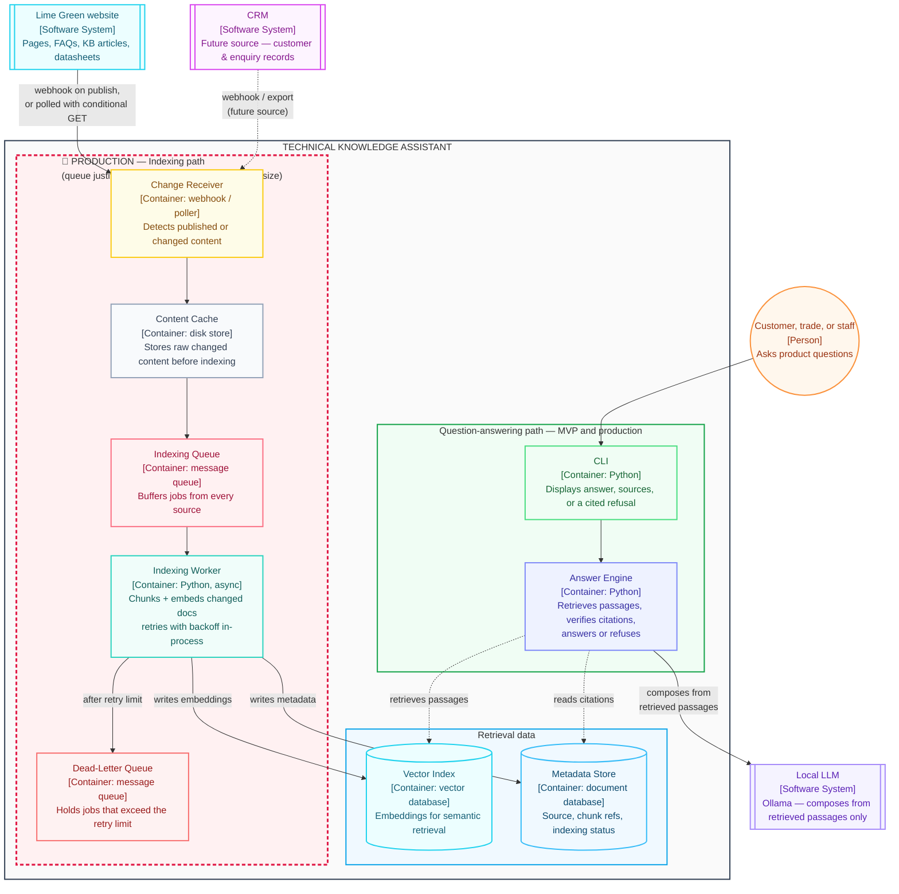
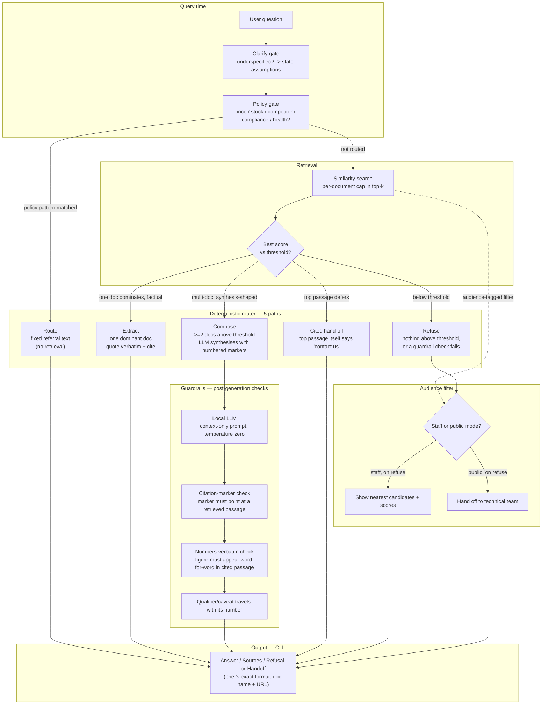

# Architecture — Technical Knowledge Assistant

Two diagrams, at two levels of detail, plus the live site inventory they're both grounded in. For the *why* behind each component (not just what connects to what), see [`architecture-rationale.md`](architecture-rationale.md).

## 1. Container view

The whole system inside one boundary, split into three groups: **Indexing path** (production only — the automatic re-index pipeline), **Retrieval data** (the shared store both paths touch), **Question-answering path** (MVP and production — what's actually built for the submission).

Source: [`diagrams/container-view.mmd`](diagrams/container-view.mmd) — paste directly into mermaid.live or Mermaid Chart.

## 2. Answer Engine detail

What "Answer Engine" in the diagram above actually does — the deterministic router and guardrail chain, derived from the mental-model record §9 (How), §10 (Bound), §11 (Build).

Source: [`diagrams/answer-engine-detail.mmd`](diagrams/answer-engine-detail.mmd)

Three things worth saying out loud from this diagram:

- **Route through the router is deterministic** — no model decides which of the five paths a question takes; a policy-pattern match, retrieval shape, or the top passage's own wording decides it.
- **The model is a narrator, never the source of a fact** — it only runs on the Compose path.
- **Guardrails run after generation, before printing** — a failed check on the Compose path routes into `REFUSE`.

## Appendix: live site inventory (decision 0)

Pulled from `lime-green.co.uk`'s `sitemap.xml` and spot-checked pages. Corrects the mental-model record's hypothesis in §8.6 where noted.

- `robots.txt` allows all crawlers and points to a real, complete `sitemap.xml` — the record assumed this couldn't be confirmed; it can. Crawl by sitemap.
- **Product pages**: 6 categories (Lime Mortar, Lime Plaster, Lime Render, Insulation, Primers & Adhesives, Stone Repair), ~35 individual pages, plus `/products-by-colour` (24 colour pages).
- **Technical datasheets**: one PDF per product, plus up to 6 other PDF types per product (SDS, UK/EU DoP, Carbon Footprint, EPD, LRV) — confirms classifying by link text, not filename, and excluding everything except the TDS.
- **Knowledge base**: `/support/knowledgebase`, 15 articles (record assumed "about five" — correct this in §8.4/§8.7).
- **FAQ**: `/support/faq`, one page, **~41 questions across 6 sections** — record cites "17 items" throughout (§10.2, §8.7, §7.6); needs correcting wherever it appears.
- **Case studies**: 24, matching the named examples already in the record.

**Rough tier-one corpus size, corrected**: ~35 product pages + ~30 TDS PDFs + 1 FAQ page (41 Q&As) + 15 KB articles + contact/find-a-supplier ≈ **83 addressable units** — above the record's "about forty documents" cap. The spend-order in §8.7/§10.2 will need to actually cut, not just theoretically allow for it.

**Not yet checked**: Warmshell subsection pages (4); `find-a-supplier`/`contact` page structure (needed for hand-off text); whether datasheet PDFs keep qualifiers/caveats in the same section as their figures; actual PDF text-extraction quality.
