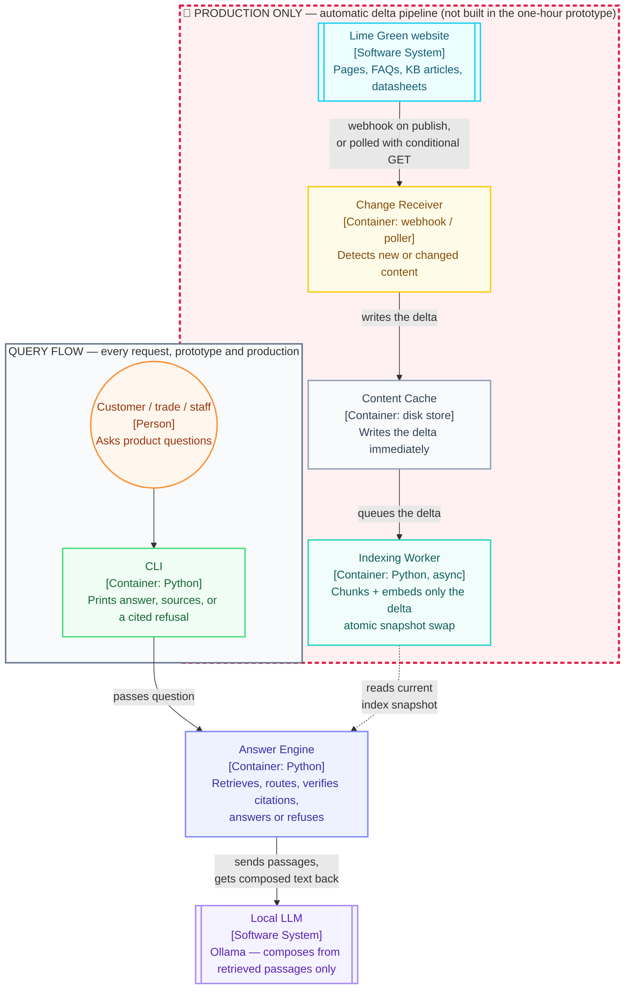

# Architecture — C4-notation container view

Five containers of your own, two external systems, laid out as two flows that only meet at `Answer Engine`. This version is a hand-laid-out flowchart using C4 notation (`[Person]`, `[Container: ...]`, `[Software System]` labels, matching colors) rather than Mermaid's native `C4Container` diagram type — the native one kept fighting its own auto-layout once custom offsets were added, producing overlapping text and crossed lines. This version routes every line explicitly, so nothing overlaps regardless of renderer.

## What's highlighted, and why

The whole delta pipeline (`Change Receiver → Content Cache → Indexing Worker`) sits inside a **red-bordered, red-titled box** labeled "🔴 PRODUCTION ONLY." That's deliberate, not decorative: everything in that box is roadmap material — none of it belongs in the one-hour prototype, which just does a single offline crawl-once script. The query flow (`user → CLI → Answer Engine → LLM`) is what both the prototype and production actually run; it sits in a plain gray box for contrast.

Say it this way on the slide: *"The core pipeline — ask, retrieve, answer — is what's built. The red box is what production adds: a hook that auto-triggers the delta flow, so only new or changed content is ever re-indexed."*

## Two flows, one meeting point

- **Background flow** (production only): `website → Change Receiver → Content Cache → Indexing Worker`. Runs on its own clock (webhook or short-interval poll), decoupled from query traffic entirely.
- **Query flow** (always): `user → CLI → Answer Engine → {index snapshot, Local LLM}`. Every query reads whichever snapshot is currently live; it never waits on indexing.

## Trigger: interval vs. event, and why

- **True webhook (push)** needs Lime Green's CMS to call an endpoint of ours on publish. Not buildable unilaterally against a site we don't own — it's a KTP-scope integration (the job description names "integration with the company's... website" directly), not a prototype feature.
- **Short-interval polling with conditional GET** (`If-None-Match` / `If-Modified-Since`) is the practical stand-in today: poll every few minutes, and an unchanged page costs a `304 Not Modified` — effectively free. It behaves like a hook without needing Lime Green's cooperation.
- **Write immediately, index asynchronously.** The `Content Cache` write happens the instant a change is detected; the `Indexing Worker` consumes a queue and may lag by seconds to minutes. This is why a query is never blocked on re-indexing, and why cost stays near zero — most polls and most indexing runs touch nothing.

## Three decisions resolved, not deferred

- **Retrieval index — in-memory numpy array, cosine similarity. No vector database.** At ~80 documents / a few hundred chunks, a dot product over the whole set is microseconds; Chroma or FAISS would add a dependency and nothing else at this scale.
- **Freshness — event-detected, asynchronously indexed. Not real-time-per-query, not blind daily batch.** A detected change is cached immediately; indexing catches up in the background; queries always read a consistent, if briefly stale, snapshot.
- **Embeddings — still needed, model still open.** Customers ask in their own words ("wall's gone damp and bubbly"); the corpus uses product vocabulary ("efflorescence"). Pure keyword search would miss too much of that gap, so *some* embedding model is worth having — which one (qwen3-embedding:0.6b vs nomic-embed-text) is a real decision 2, left open.
- **Local LLM — still open**, pending the latency test (decision 1 in the agent prompt). Shown here as an external system because, architecturally, it is one: a black box the Answer Engine calls over Ollama's API, swappable without touching the rest of the pipeline.

## Fallback if your Mermaid renderer doesn't support flowchart subgraphs with `style`

This should render anywhere modern (GitHub, mermaid.live, VS Code preview). If something strips `classDef`/`style` lines, [`system-architecture.mmd`](system-architecture.mmd) is a more detailed, older version of the same shape as a plain flowchart.
