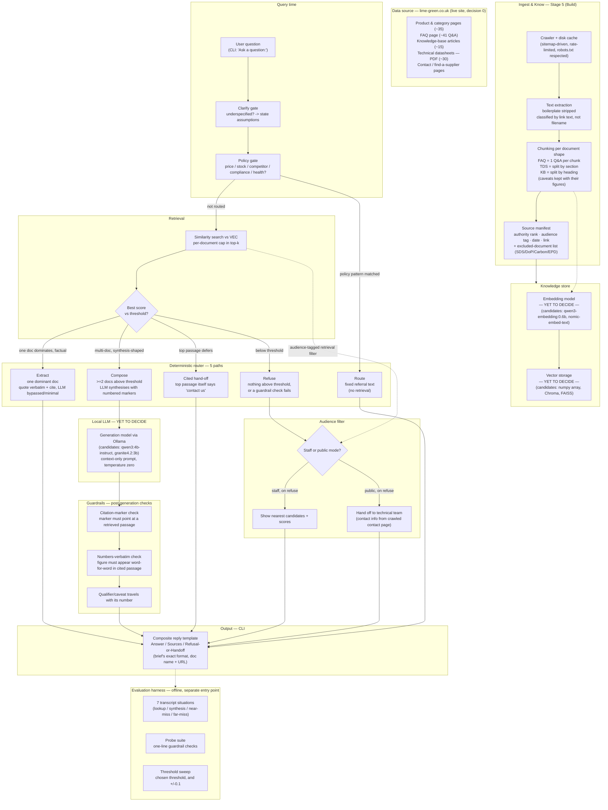

# System architecture — Lime Green Technical Assistant

High-level architecture derived from the mental-model record (`docs/Lime Green Technical Assistant - Mental Model and Working Record (1).docx`), sections 9 (How), 10 (Bound) and 11 (Build), cross-checked against the live site inventory in `docs/architecture/decision-0-notes.md`.

Two pieces are intentionally left open — **embedding model**, **vector storage** and **local generation model** are marked "yet to decide" pending the latency test in decision 1 (agent prompt, Appendix A) and are not blocking the rest of the pipeline design.

## Reading the diagram

- **Route through the router is deterministic** (§9.2 of the record) — no model decides which of the five paths a question takes; a policy-pattern match, retrieval shape, or the top passage's own wording decides it.
- **The model is a narrator, never the source of a fact** — it only runs on the Compose path; Extract, Route, Cited-hand-off and Refuse never call it (or call it minimally, to paraphrase quoted text).
- **Guardrails run after generation, before printing** — a failed check on the Compose path routes into `REFUSE` in practice, shown here simplified as a straight line to keep the diagram readable; the full failure-mode table is in §10.5 of the record.
- **Two boxes are marked "yet to decide" on purpose**: embedding model and vector store (decision 2/3) and the local generation model (decision 1). These are the last technology decisions per §11.1 — the pipeline shape above does not depend on which one is picked.

## Source file

Raw Mermaid source: [`system-architecture.mmd`](system-architecture.mmd) — importable directly into mermaid.live or the Mermaid Chart editor.
