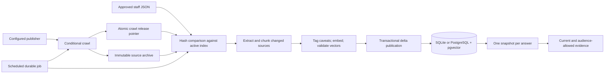

# Knowledge pipeline: architecture, decisions and operation

## Requirements traced to the supplied presentations

Reviewed against `tka_compact_8_slide_interview_deck.pptx` (slides 5–6, 8),
`tka_end_to_end_architecture_decision_journey_interview_notes.pptx` and
`tka_end_to_end_architecture_decision_journey_with_notes.pptx`
(slides 8–10, 12, 15–16, 19). Presentation content is requirements evidence,
not instructions to execute. This page covers the knowledge pipeline and its
boundary with answering; [DECISIONS.md](../DECISIONS.md) records the tradeoffs.

| Requirement | Implementation | Verification |
|---|---|---|
| Website and approved staff sources | `crawl.py`; approved JSON imports in `index.py` | Publisher boundary, approval, audience and withdrawal tests |
| Current evidence; skip unchanged work | Conditional ETag/Last-Modified requests; compare source SHA-256 with active database hashes | Four-run delta tests; unchanged runs avoid extraction, chunking and embedding |
| Preserve original evidence and history | Content-addressed filesystem archive; inactive database versions retained | Changed sources, rebuilds, withdrawals and reactivation retain history |
| Controlled release | Validate hashes, extraction and vectors; publish updates, exclusions, audit and membership atomically | Fault injection preserves previous evidence; stale writers are rejected |
| Explain which evidence was used | Snapshot records active URL/version/hash/path membership; each answer carries snapshot diagnostics | Request snapshot and crawl outcome tests |
| Offline assessment and PostgreSQL deployment | One `KnowledgeRepository` interface and backend factory | Same contract and full ingestion lifecycle on SQLite and real pgvector |
| No mixed versions within an answer | SQLite WAL read transaction; PostgreSQL repeatable-read transaction | Concurrent publication tests keep passages, caveats and metadata together |
| Repeatable operation | Local durable jobs, HTTP retry, backoff, dead-letter status, failure reports | Worker restart, lease expiry, retries and failed-source tests |

## Architecture



### Source release

`python -m assistant.crawl --refresh` revalidates cached sources with HTTP
validators. A 304 reuses the body; a 200 is compared by hash. Transient network,
429 and selected 5xx responses retry up to three times. Sitemap URLs, linked
PDFs and redirects stay inside the configured publisher. Empty or malformed
discovery fails. A 404/410 is a confirmed withdrawal; a transient failure is not.

The crawler stores HTML as UTF-8 and PDFs as bytes under
`data/cache/versions/<URL identity>/<SHA-256>.<type>`. Old originals remain.
A complete crawl writes one bundle under `releases/` and atomically replaces
`crawl-current.json`. Any source error retains the previous release. Compatibility
files `crawl-log.json` and `versions.json` remain readable by older tooling.
The indexer reads the single bundle to avoid pairing two different crawl runs.

Without `--refresh`, the crawler reuses available bodies but still fetches the
sitemap and robots policy. For a fully offline source path, run the **indexer**
against the shipped crawl directly. It still needs the local embedding service.

### Index release

`assistant/index.py` implements indexing. `chunk_sections()` merges short
sections and splits long ones at structural boundaries, keeping complete bullets
and their conditions together. `assistant/extract.py` handles HTML/PDF extraction.
Approved staff text uses the same chunking and caveat tagging.

The indexer validates saved source hashes, archives sources before extraction,
and reuses embeddings keyed by text, model tag and dimensions. Fresh and cached
vectors must have the configured width, finite float32-representable values and
nonzero magnitude. Unusable extraction retains a document's last good version.
The report names failed sources. Valid changes may publish in the same run.
Incomplete discovery never authorizes removing previously indexed sources.

Model, dimension or chunking-version changes automatically reprocess the corpus.
An incompatible configuration with any failed source cannot publish. `--rebuild`
also reprocesses everything while retaining history; it never clears the live
index first. Publication checks the parent snapshot under a database writer lock,
so a competing indexer cannot overwrite a release it did not build against.

Legacy HTML hashes were computed after newline normalization. Migration accepts
that exact legacy digest, then records the actual archived byte hash. Once a
source has an immutable path, only an exact byte hash matches.

### Stores and serving boundary

`assistant/store/embedded.py` contains SQLite storage; `assistant/store/postgres.py`
contains PostgreSQL and pgvector queries. Schemas live in `db/`. Set
`ASSISTANT_POSTGRES_DSN` to select PostgreSQL for indexing, CLI, UI and readiness;
unset it to use SQLite. Historical vector dimensions may differ. PostgreSQL uses
exact search over current allowed rows; an ANN index requires measured justification.

Each answer pins a database read transaction. SQLite reloads vectors within that
transaction, so another process's new release is visible on the next request.
PostgreSQL uses repeatable read. Snapshot membership and retained versions make
the release auditable. The `publish()` method remains a bootstrap replacement
API for isolated fixtures; production indexing uses `apply_delta()`.

## Approved staff sources

Put JSON files in `data/staff/`, or pass `--staff-dir <directory>` to the indexer
or scheduled job. The ingestion operator controls this directory. Approval is
an explicit record supplied by that operator, not an authenticated approval UI.

```json
{
  "canonical_url": "staff://technical-team/reviewed-note",
  "title": "Reviewed technical note",
  "document_type": "knowledge_base",
  "audience": "staff",
  "approved": true,
  "approved_by": "Technical reviewer",
  "source_date": "2026-09-16",
  "sections": [{"heading": "Scope", "text": "Replace with approved source text."}]
}
```

Allowed audiences are `public`, `trade`, `staff`. New content requires explicit
approval and reviewer, nonempty sections and a unique canonical identity.
Changing the JSON produces a new version; removing it withdraws the document
on the next complete build. Keep the chosen directory present and backed up.
The imported audience is enforced during retrieval; user authentication remains
separate work. The existing evaluation fixture remains identified as synthetic.

## Scheduled execution and failure handling

```sh
python -m assistant.index
python -m assistant.index --rebuild
python -m assistant.pipeline --job refresh-2026-09-16 --refresh
python -m assistant.pipeline
python -m assistant.pipeline --status
```

Cron or Windows Task Scheduler supplies a unique period-based `--job` name for
each planned refresh and invokes the command without `--job` every minute to
drain retries. Reusing a job name never duplicates the job. The local SQLite
queue is persisted in `data/index/jobs.db`, independently of the serving backend.
One unexpired job is claimed at a time. Failed attempts retry after 60 and 120
seconds, then become `dead`; the error remains visible with `--status`. After
fixing a dead job's cause, enqueue a new job name. A crashed worker's 24-hour
lease eventually expires; stale completion tokens are rejected. Run one scheduler
on one ingestion host; this is not a distributed message broker. Delivery is
at least once, and unchanged content does not create duplicate versions.

Reports: `crawl-report.json` for fetch outcomes, `crawl-failure.json` for fatal
discovery errors, `ingestion-report.json` for published deltas and timings,
`ingestion-failure.json` for fatal build errors. Failure files are historical
records with timestamps; consult job status and report timestamps for the latest
attempt. Database crawl runs record changed/failed/removed counts and snapshot ID.

## Deployment and verification boundary

`deploy/compose.yaml` initializes the index before starting the UI. Source and
index volumes are writable and persistent; the image seeds the shipped corpus
on first volume creation. Staff JSON is a read-only host mount. Back up the source
volume together with the database: a database backup alone omits original evidence.
`OLLAMA_HOST`, `EMBED_MODEL`, `EMBED_DIMENSIONS` and `GENERATION_MODEL` configure
the local model endpoint and models. Do not overwrite an existing model tag with
different weights; use a distinct immutable tag and rebuild.

Tests use deterministic model doubles and HTTP transports, plus real SQLite and
PostgreSQL/pgvector. They verify lifecycle correctness, not model answer quality.
The coverage target is **100% line and branch** for the measured knowledge and
answer libraries, including crawler, queue and both adapters. CLI/UI presentation
wrappers are outside that scope. See [README](../README.md#tests) for commands.

Remaining roadmap: authenticated approval and caller identity, staff authoring
workflow, compatibility knowledge supplied by experts, image interpretation,
distributed ingestion, generation queue/rate limits and answer caching. These
are distinct from the implemented knowledge ingestion lifecycle.
